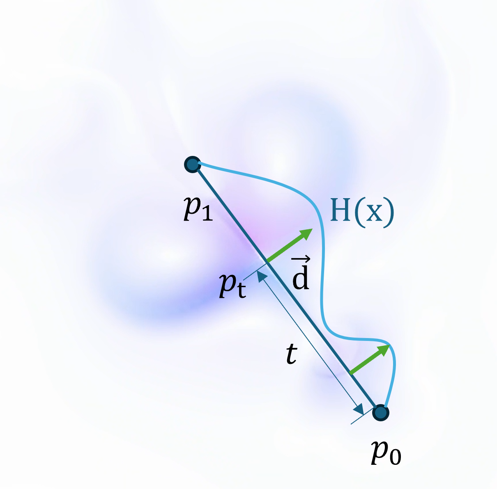
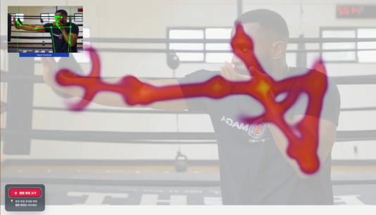

# Real-Time Interactive Smoke Simulation on the Web

## 📝 Overview

본 프로젝트는 **웹 브라우저 환경에서 실시간으로 사용자 움직임에 반응하는 연기 시뮬레이션 시스템**을 구현한 소프트웨어입니다. **WebGL 기반 유체 시뮬레이션**과 **MediaPipe 포즈 추정**을 결합하여, 사용자의 신체 움직임을 연기 형태의 시각적 피드백으로 실시간 변환합니다.

특히 기존의 Simplex Noise 기반 전역(Global) 난류 생성 방식의 한계를 보완하기 위해, **조화 함수(Harmonic Function) 매핑을 이용한 국소적(Local) 외력 생성 기법**을 제안합니다. 이를 통해 사용자의 관절 주변에서 방향성과 리듬감을 갖는 자연스러운 연기 흐름을 생성할 수 있습니다.

> 💡 **Reference Implementation**
> 본 저장소는 논문에서 제안한 기법의 **재현 가능한 구현(reference implementation)**을 제공하며, 웹 환경에서도 고품질 유체 상호작용이 가능함을 실증합니다.

---

## 🏗 System Architecture

  
   
  <b>Figure 1. Software Architecture</b>

본 시스템은 다음과 같은 파이프라인으로 구성됩니다.

1.  **Webcam Stream Input**
    * 웹캠으로부터 실시간 비디오 프레임을 획득합니다.
2.  **Pose Detection (MediaPipe)**
    * MediaPipe를 사용하여 매 프레임마다 사용자의 관절 랜드마크를 추론합니다.
3.  **Fluid Simulation Solver**
    * 2차원 유체 방정식을 수치적으로 계산하여 속도장과 밀도장을 업데이트합니다.
4.  **Force Field Generation (Proposed)**
    * 스켈레톤 선분을 기준으로 **조화 함수 매핑 기반의 외력**을 생성합니다.
5.  **Rendering (WebGL / GLSL)**
    * Fragment Shader에서 연기 밀도를 시각화하며, 시각적 스타일은 실시간으로 변경 가능합니다.

---

## 🌊 Turbulence Generation Comparison

  
   
  <b>Figure 2. Comparison of Turbulence Generation Methods</b>

* **(a) Raw Density Visualization**
    * 외력이나 난류가 없는 경우, 경계가 부자연스럽게 나타납니다.
* **(b) Simplex Noise + Buoyancy**
    * 전역적인 난류는 형성되지만, 사용자 움직임과의 연관성은 약합니다.
* **(c) Harmonic Function Mapping Only**
    * 규칙적인 파동 패턴은 형성되나 자연스러운 연기 형태는 부족합니다.
* **(d) Proposed Method (Combined)**
    * 제안한 **조화 함수 매핑을 Simplex Noise 기반 배경 난류와 결합**하여, 국소적이며 자연스러운 연기 흐름을 생성합니다.

---

## ⚡ Harmonic Function–Based Force Mapping

  
   
  <b>Figure 3. Harmonic Function Mapping Algorithm</b>

스켈레톤을 구성하는 선분을 기준으로, 픽셀 단위에서 다음 과정을 수행합니다.

1.  선형 보간을 통한 선분 상 위치 계산
2.  픽셀로 향하는 방향 벡터 및 거리 산출
3.  조화 진동 함수(Harmonic Oscillation) 적용
4.  거리 기반 감쇠를 통한 발산형 외력 생성

이 방식은 전역 노이즈에 의존하지 않고, **사용자 움직임에 직접적으로 연동되는 국소적(force-localized) 유체 제어**를 가능하게 합니다.

---

## 🎨 Visual Style and AR Composition

### Visual Style Variations

  
   
  <b>Figure 9. Visual Style Variations</b>

Fragment Shader를 수정하여 연기의 색감과 분위기를 자유롭게 변경할 수 있습니다. 차가운 색감(Cool tone)부터 따뜻한 분위기(Warm tone)까지 다양한 시각적 스타일을 지원합니다.

### AR-like Composition with Background Video

  
   
  <b>Figure 10. AR-like Composition with Background Video</b>

배경 영상 기능을 활성화하면, 웹캠 영상 위에 연기 레이어가 합성되어 사용자의 실제 움직임 위에 가상의 연기가 덧입혀진 듯한 **증강현실(AR) 효과**를 제공합니다.

---

## 🚀 Demo

  

**Demo Overview**

* ✅ 실시간 포즈 인식 기반 연기 생성
* ✅ 조화 함수 매핑에 따른 국소적 유체 반응
* ✅ 파라미터 조절에 따른 연기 형태 변화